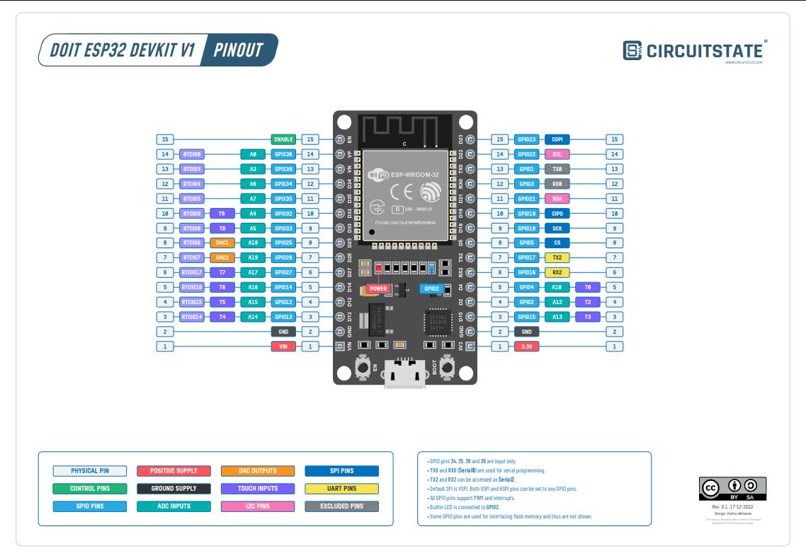

# Home Automation with ESP Rainmaker using ESP32

## Overview

This project implements home automation functionalities using the ESP32 microcontroller and ESP Rainmaker framework. ESP Rainmaker simplifies the development of IoT applications by providing a suite of tools and APIs for device configuration, cloud connectivity, and remote control.

## Features

- **Device Configuration**: Easily configure device parameters such as Wi-Fi credentials and MQTT settings using the ESP Rainmaker mobile app.
- **Cloud Connectivity**: Seamlessly connect your ESP32 device to popular cloud platforms for data logging and remote monitoring.
- **Remote Control**: Control home appliances and devices remotely through the ESP Rainmaker app or web interface.
- **Modular Design**: Implement custom functionalities and integrate various sensors and actuators to suit your home automation needs.
- **Scalable**: Expand your home automation system by adding multiple ESP32 devices and integrating them into a unified network.

## Hardware Requirements

- ESP32 Development Board
- Sensors (e.g., temperature, humidity, motion)
- Actuators (e.g., relays for controlling lights, fans)
- Power Supply

## Software Requirements

- Arduino IDE with ESP32 Board Support
- ESP Rainmaker Library
- ESP Rainmaker Mobile App (for device configuration and control)

## Installation

1. Install the Arduino IDE and ESP32 board support.
2. Install the ESP Rainmaker library using the Arduino Library Manager.
3. Clone or download the project repository from GitHub.
4. Open the project in the Arduino IDE and upload it to your ESP32 device.

## Usage

1. Configure your ESP32 device using the ESP Rainmaker mobile app or web interface.
2. Connect the device to your home Wi-Fi network and MQTT broker.
3. Customize device functionalities and integrate sensors/actuators as needed.
4. Monitor and control your home automation system using the ESP Rainmaker app or web interface.

## Contributing

Contributions to this project are welcome! Feel free to fork the repository, make improvements, and submit pull requests.

## License

This project is licensed under the [MIT License](LICENSE).

## Resources

- [ESP Rainmaker Documentation](https://rainmaker.espressif.com/docs/)
- [ESP32 Arduino Core Documentation](https://docs.espressif.com/projects/arduino-esp32/en/latest/)
- [ESP32 Community Forum](https://esp32.com/)
- [GitHub Repository](https://github.com/your-username/esp32-home-automation)

## Authors

- [Your Name](https://github.com/your-username)

## Acknowledgments

- Thanks to Espressif Systems for developing ESP Rainmaker and the ESP32 platform.
- Special thanks to the open-source community for their contributions and support.

## Screenshots

